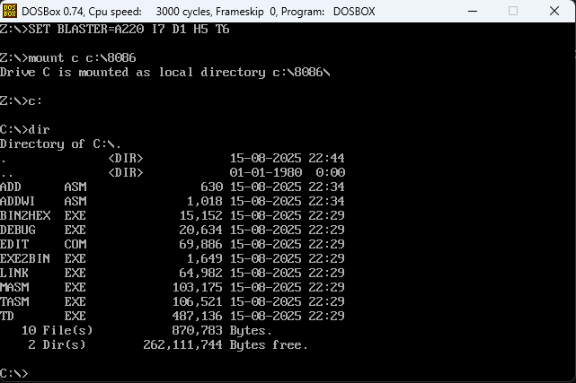

# MASM DOSBOX GUIDE
Please refer this tutorial for MASM in DOSBOX

## Softwares
1. DOSBox 0.74 Win32 : [Dowload](https://drive.google.com/file/d/176Z06b5Z1VtzLUKkmuUNlq5JYxEsoVUS/view?usp=sharing)
2. MASM 8086 Assembler : [Download](https://drive.google.com/file/d/1_N9UYTy_DL5Bb4zE7Tt97VRpCrtC0SqU/view?usp=sharing)

## How to Setup and RUN
1. Download and Install DOSBox
2. Download and extract MASM 8086 Assembler 
3. From the extracted folder copy the `8086` folder into `C:` drive.
4. Save the assembly code that you want to compile into this folder. Example `ADD.ASM`. Sample assemply codes can be found in this repository.
5. Start DOSBox 


6. Mount the `8086` Folder in DOSBox using following command.
```
mount c c:\8086
```
7.  Change the Drive to C Drive using following command
```
c:
```
8.  Now you can use the `dir` command to check the files in the directory.
   


9. Lets Compile and Run `ADDWI.ASM`
10. First use `MASM.EXE` to compile `ADDWI.ASM`. Press enter if there are any prompts. At the end of compilation check if there is 0 errors.
```
MASM.EXE ADDWI.ASM
```


11. Use `LINK.EXE` to Make the `ADDWI.EXE` File
```
LINK.EXE ADDWI.OBJ
```


12. Run the `ADDWI.EXE`
```
ADDWI.EXE
```


13. To debug any program use `DEBUG.EXE`. Check below for various keys to be used in debug mode.
```
DEBUG.EXE ADDWI.EXE
```


## DEBUG.EXE Command Reference
| Command | Meaning                                        | Usage Example                                          |
| ------- | ---------------------------------------------- | ------------------------------------------------------ |
| `A`     | Assemble (enter instructions)                  | `A 100` → starts entering assembly at address `0100h`. |
| `U`     | Unassemble (view instructions)                 | `U 100`                                                |
| `D`     | Dump memory (view contents in hex/ASCII)       | `D 100`                                                |
| `E`     | Enter data into memory                         | `E 200 41 42 43`                                       |
| `R`     | View/modify registers                          | `R` or `R AX`                                          |
| `T`     | Trace one instruction (step-by-step execution) | `T`                                                    |
| `P`     | Proceed (like `T`, but steps over calls)       | `P`                                                    |
| `G`     | Go (run program until breakpoint or end)       | `G`                                                    |
| `N`     | Name a file for loading/saving                 | `N PROG.COM`                                           |
| `L`     | Load program from file                         | `L`                                                    |
| `W`     | Write memory to file                           | `W`                                                    |
| `Q`     | Quit debug                                     | `Q`                                                    |

## List of Codes Samples
1. Add two 8bit numbers [View](codes/ADD.ASM)
2. Add two 8bit numbers with Input from User [View](codes/ADDWI.ASM)
3. Subtract two 8bit numbers [View](codes/SUB.ASM)
4. Subtract two 8bit numbers with Input from User [View](codes/SUBWI.ASM)
5. Multiply two 8bit numbers [View](codes/MUL.ASM)
6. Multiply two 8bit numbers with Input from User [View](codes/MULWI.ASM)
7. Divide two 8bit numbers [View](codes/DIV.ASM)
8. Divide two 8bit numbers with Input from User [View](codes/DIVWI.ASM)
9. AND Operation [View](codes/AND.ASM)
10. AND Operation with Input from User [View](codes/ANDWI.ASM)
11. OR Operation [View](codes/OR.ASM)
12. OR Operation with Input from User [View](codes/ORWI.ASM)
13. XOR Operation [View](codes/XOR.ASM)
14. XOR Operation with Input from User [View](codes/XORWI.ASM)
15. NOT Operation [View](codes/NOT.ASM)
16. NOT Operation with Input from User [View](codes/NOTWI.ASM)
17. Implementation of two 8-bit BCD addition with accepting input from keyboard and displaying output on monitor using INT 21H interrupts [View](codes/BCDADD.ASM)
18. Implement I/O interfacing using inbuilt speakers [View](codes/ALARM.ASM)
19. Implement I/O interfacing using inbuilt speakers different tones [View](codes/ALARMKEY.ASM)

## 8086 Instruction Set
The instruction set is basically the big menu of commands the CPU understands. Each instruction belongs to a certain category depending on what it does.

### 1. Data Transfer Instructions
Used to move data between registers, memory, and I/O ports.
| Instruction | Meaning                | Example                |
| ----------- | ---------------------- | ---------------------- |
| `MOV`       | Copy data              | `mov ax, bx` ; AX = BX |
| `XCHG`      | Swap data              | `xchg ax, bx`          |
| `LEA`       | Load effective address | `lea dx, msg`          |
| `PUSH`      | Push to stack          | `push ax`              |
| `POP`       | Pop from stack         | `pop bx`               |
| `IN`        | Input from port        | `in al, 60h`           |
| `OUT`       | Output to port         | `out 64h, al`          |

⚡ Tip: MOV can’t directly move from memory-to-memory in one step.

### 2. Arithmetic Instructions
Perform addition, subtraction, multiplication, division, increment/decrement.
| Instruction | Meaning                    | Example                 |
| ----------- | -------------------------- | ----------------------- |
| `ADD`       | Add                        | `add ax, bx`            |
| `ADC`       | Add with carry             | `adc ax, bx`            |
| `SUB`       | Subtract                   | `sub cx, ax`            |
| `SBB`       | Subtract with borrow       | `sbb ax, bx`            |
| `INC`       | Increment by 1             | `inc dx`                |
| `DEC`       | Decrement by 1             | `dec si`                |
| `MUL`       | Unsigned multiply          | `mul bl` ; AX = AL × BL |
| `IMUL`      | Signed multiply            | `imul bx`               |
| `DIV`       | Unsigned divide            | `div bl`                |
| `IDIV`      | Signed divide              | `idiv bx`               |
| `CBW`       | Convert byte to word       | Extends AL → AX         |
| `CWD`       | Convert word to doubleword | Extends AX → DX\:AX     |

### 3. Logical Instructions
Perform bitwise logic and shifts.

| Instruction | Meaning                                 | Example                 |
| ----------- | --------------------------------------- | ----------------------- |
| `AND`       | Bitwise AND                             | `and al, 0Fh`           |
| `OR`        | Bitwise OR                              | `or ah, 80h`            |
| `XOR`       | Bitwise XOR                             | `xor bx, bx` ; clear BX |
| `NOT`       | Bitwise NOT (invert)                    | `not al`                |
| `TEST`      | AND without storing result (sets flags) | `test al, 1`            |
| `SHL/SAL`   | Shift left                              | `shl al, 1`             |
| `SHR`       | Logical shift right                     | `shr al, 1`             |
| `SAR`       | Arithmetic shift right                  | `sar al, 1`             |
| `ROL`       | Rotate left                             | `rol al, 1`             |
| `ROR`       | Rotate right                            | `ror al, 1`             |
| `RCL`       | Rotate through carry left               | `rcl al, 1`             |
| `RCR`       | Rotate through carry right              | `rcr al, 1`             |

### 4. Control Transfer Instructions
Change the flow of execution (jumps, calls, returns).
| Instruction | Meaning                             | Example      |
| ----------- | ----------------------------------- | ------------ |
| `JMP`       | Unconditional jump                  | `jmp start`  |
| `JE/JZ`     | Jump if equal / zero flag set       | `je label`   |
| `JNE/JNZ`   | Jump if not equal / zero flag clear | `jne label`  |
| `JC`        | Jump if carry set                   | `jc label`   |
| `JNC`       | Jump if carry clear                 | `jnc label`  |
| `JS`        | Jump if sign flag set               | `js label`   |
| `JNS`       | Jump if sign flag clear             | `jns label`  |
| `JO`        | Jump if overflow                    | `jo label`   |
| `JNO`       | Jump if no overflow                 | `jno label`  |
| `JG/JNLE`   | Jump if greater                     | `jg label`   |
| `JL/JNGE`   | Jump if less                        | `jl label`   |
| `LOOP`      | Decrement CX and jump if CX ≠ 0     | `loop label` |
| `CALL`      | Call a subroutine                   | `call proc1` |
| `RET`       | Return from subroutine              | `ret`        |

### 5. String Instructions
Operate on blocks of memory (arrays, strings). Often used with REP prefix.

| Instruction        | Meaning                 | Example        |
| ------------------ | ----------------------- | -------------- |
| `MOVS/MOVSB/MOVSW` | Copy string data        | `movsb` ; byte |
| `LODS/LODSB/LODSW` | Load string to AL/AX    | `lodsb`        |
| `STOS/STOSB/STOSW` | Store string from AL/AX | `stosb`        |
| `SCAS/SCASB/SCASW` | Scan string for value   | `scasb`        |
| `CMPS/CMPSB/CMPSW` | Compare strings         | `cmpsb`        |

🔹 Use with:
 - REP — repeat while CX > 0
 - REPE / REPZ — repeat while equal / zero
 - REPNE / REPNZ — repeat while not equal / not zero

### 6. Processor Control Instructions
Affect the CPU’s operation directly.
| Instruction | Meaning               | Example       |
| ----------- | --------------------- | ------------- |
| `NOP`       | No operation          | `nop`         |
| `HLT`       | Halt until interrupt  | `hlt`         |
| `WAIT`      | Wait for coprocessor  | `wait`        |
| `STC`       | Set carry flag        | `stc`         |
| `CLC`       | Clear carry flag      | `clc`         |
| `CMC`       | Complement carry flag | `cmc`         |
| `STD`       | Set direction flag    | `std`         |
| `CLD`       | Clear direction flag  | `cld`         |
| `INT n`     | Software interrupt    | `int 21h`     |
| `IRET`      | Return from interrupt | `iret`        |
| `ESC`       | Escape to coprocessor | Used for 8087 |

### 7. Miscellaneous
Other specialized commands.
| Instruction                | Meaning                           |
| -------------------------- | --------------------------------- |
| `AAA`, `AAS`, `AAM`, `AAD` | ASCII adjust after arithmetic     |
| `DAA`, `DAS`               | Decimal adjust for BCD            |
| `XLAT`                     | Translate byte using lookup table |

## Input / Output in MASM
Input and output (I/O) are usually done through DOS interrupts, specifically INT 21h, which provides many system services like reading a character from the keyboard or printing a character/string to the screen.

### **1️⃣ Input from Keyboard**

#### **Single Character Input**

* **DOS function:** `01h` → Read a character from standard input.
* **Register setup:**

  * `AH = 01h`
  * Call `INT 21h`
* **Result:** ASCII code of the key pressed is returned in `AL`.

##### **Example: Read a character**

```asm
MOV AH, 01H    ; DOS function: read character
INT 21H        ; call DOS interrupt
; AL now contains ASCII code of key pressed
```

* If you want the **numeric value** of a digit (e.g., '5'), subtract `30h`:

```asm
SUB AL, 30H    ; Convert ASCII '0'-'9' to number 0-9
```

---

#### **String Input**

* **DOS function:** `0Ah` → Buffered input.
* **Registers:**

  * `AH = 0Ah`
  * `DX = offset of buffer`
* **Buffer format:**

  ```
  [buffer_size] [num_chars_read] [characters...]
  ```
* This is more complex and used for multi-character input.

---

### **2️⃣ Output to Screen**

#### **Single Character Output**

* **DOS function:** `02h` → Write character to standard output.
* **Register setup:**

  * `AH = 02h`
  * `DL = ASCII character to print`
* **Call interrupt:**

```asm
MOV DL, 'A'   ; character to print
MOV AH, 02H   ; DOS function: print character
INT 21H       ; call DOS interrupt
```

---

#### **String Output**

* **DOS function:** `09h` → Display a string ending with `$`.
* **Register setup:**

  * `AH = 09h`
  * `DX = offset of string`
* **Example:**

```asm
MSG DB 'Hello, world!$'
MOV AH, 09H
LEA DX, MSG
INT 21H
```

* Strings must be **terminated with `$`** for DOS to know where to stop printing.

---

### **3️⃣ Example – Input a Digit and Print It**

```asm
.MODEL SMALL
.STACK 100H
.DATA
    msg1 DB 'Enter a digit (0-9): $'
    result DB ?

.CODE
MAIN PROC
    MOV AX, @DATA
    MOV DS, AX

    ; Display prompt
    MOV AH, 09H
    LEA DX, msg1
    INT 21H

    ; Read a character
    MOV AH, 01H
    INT 21H
    SUB AL, 30H         ; Convert ASCII to number
    MOV result, AL

    ; Print result
    ADD AL, 30H         ; Convert back to ASCII
    MOV DL, AL
    MOV AH, 02H
    INT 21H

    ; Exit
    MOV AH, 4CH
    INT 21H
MAIN ENDP
END MAIN
```

---

#### **Summary**

| Action            | DOS Function | Registers                                  |
| ----------------- | ------------ | ------------------------------------------ |
| Input single char | 01h          | AH=01h → AL = ASCII                        |
| Input string      | 0Ah          | AH=0Ah, DX=buffer                          |
| Output char       | 02h          | AH=02h, DL = ASCII                         |
| Output string     | 09h          | AH=09h, DX = string address (ends with \$) |


## Other Tools
1. 8086 Online Assembler : [View](https://yjdoc2.github.io/8086-emulator-web/)
2. emulator8086 : [Download](https://drive.google.com/file/d/1lohwzsB3tOu0kYBzcZypJA4khm46P2HI/view?usp=sharing)
3. 8086 Manual : [View](https://drive.google.com/file/d/1HZSK2e4sOsduEIBpAr9-MOK8d7Arz7b2/view?usp=sharing)
